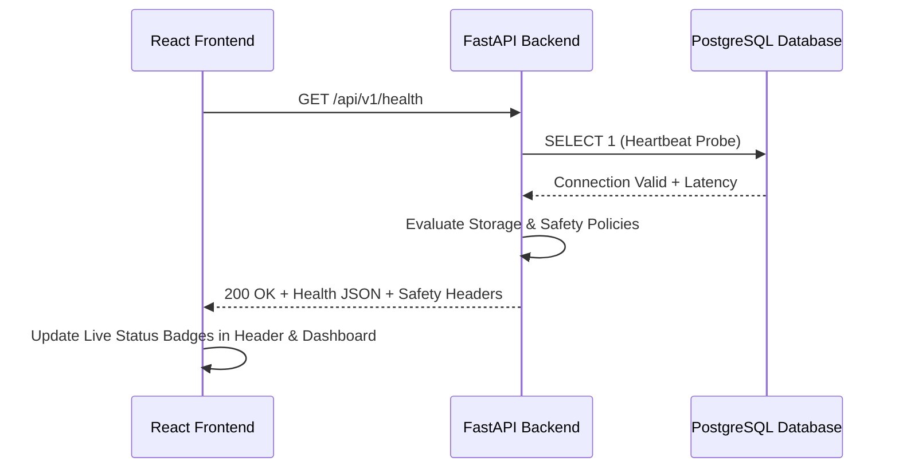

# MedLens System Architecture Document

## Overview

MedLens is architected as a full-stack, modular clinical intelligence system designed with clinical safety, cryptographic provenance, and human-in-the-loop validation as core design tenets.

```
/medlens
│
├── frontend/                # React 18 + TypeScript + Tailwind CSS + Vite
│   ├── src/
│   │   ├── components/      # UI component library (Buttons, Cards, Forms, Modals, etc.)
│   │   ├── layouts/         # AppLayout with responsive sidebar & clinical header
│   │   ├── pages/           # Dashboard, SystemHealth, Patients, Reports, Provenance
│   │   ├── services/        # Centralized HTTP client with network & error handling
│   │   ├── hooks/           # useHealthCheck telemetry hook
│   │   ├── types/           # TypeScript interfaces for all domain models
│   │   └── utils/           # Formatters and classNames merging
│   └── package.json
│
├── backend/                 # Python 3.14 + FastAPI + SQLAlchemy 2.0
│   ├── app/
│   │   ├── api/routes/      # Versioned API routes (/api/v1/health)
│   │   ├── core/            # Configuration, safety boundaries, and policies
│   │   ├── database/        # Engine, sessionmaker, and Base
│   │   ├── models/          # Declarative SQLAlchemy models (8 architectural models)
│   │   ├── schemas/         # Pydantic validation schemas
│   │   ├── services/        # Domain business logic services
│   │   ├── utils/           # Formatters, structured logging, custom exceptions
│   │   └── main.py          # FastAPI application entry point with CORS & error handlers
│   ├── alembic/             # Database migration scripts and version tracking
│   ├── tests/               # Pytest automated test suite
│   ├── requirements.txt     # Locked backend dependencies
│   └── alembic.ini          # Alembic configuration
│
├── database/                # PostgreSQL schema documentation & scripts
│   ├── init.sql             # Foundation schema and extensions
│   └── README.md
│
├── docs/                    # Architecture, safety, and API specifications
│   ├── architecture.md
│   ├── medical_safety.md
│   ├── database_schema.md
│   └── api_reference.md
│
├── README.md                # Main documentation and quickstart
├── .gitignore               # Multi-stack ignore rules
└── .env.example             # Environment configuration template
```

---

## Technical Stack

| Tier | Technology | Rationale |
|---|---|---|
| **Frontend UI** | React 18, TypeScript, Tailwind CSS | High reliability, type safety, accessible components |
| **Routing** | React Router v6 | Declarative client-side routing (`/`, `/dashboard`, `/system-health`) |
| **Backend API** | FastAPI, Python 3.14 | High-performance asynchronous REST API with automatic OpenAPI specs |
| **Data Validation** | Pydantic v2 | Strict request/response validation and error schemas |
| **ORM & Database** | SQLAlchemy 2.0, PostgreSQL | Production-grade relational data modeling and transaction safety |
| **Migrations** | Alembic | Version-controlled, reproducible database schema migrations |
| **Testing** | Pytest, Vitest, Testing Library | End-to-end backend and frontend test coverage |

---

## Communication Flow


